# 私が見たRig Exploit Kitの姿
## はじめに
私はDrive-by Download攻撃について趣味で調べ始めてから3ヶ月が経ちました. それまでは攻撃の概要をぼんやりと知っていただけでしたが, 実際にpseudo-DarkleechやEITestなどのCampaignを追いかけ, 限定的なものではありますが, Drive-by Download攻撃の最前線を見ることが出来ました. 今回は私が今まで調査したことの中でも, 特に面白く, 私を熱中させてくれたRig Exploit Kitについて, 今私が知っている情報の一部を体系的にまとめます. 既知の内容が殆どであることは分かっていますが, 最新の攻撃動向を出来る限り全体を俯瞰すること, 日本語で書くことに意味があると考え, これを公開します.

## Rig Exploit Kitとは(概要)
Rig Exploit Kit(RigEK)とは, 現在Drive-by Download攻撃(DbD)で最も利用されているExploit Kitの1つです. DbDとは, 攻撃者が用意したmaliciousなWebサイトや, 攻撃者によってmaliciousなコードがinjectされた一般のWebサイト(Compromisedサイト)へアクセスしたユーザに対して, 幾つかのリダイレクト(drive)を行い, 最終的にマルウェアをダウンロード・インストールさせる攻撃のことです. マルウェアをダウンロードさせるためにブラウザやその他プラグインの脆弱性を突くようなExploit Codeが攻撃者のサーバから送られ, そのコードによってマルウェアがdropし, 感染してしまいます. それらの攻撃の流れを容易に行うために作られているものがExploit Kitです. Exploit Kitを使うことで, 攻撃者は専門的な知識や技能を持たなくても, 容易にDbDを仕掛けることが出来ます. Rigは2016年9月頃から急激にシェアを増やし, 現在では多くのDbD Campaignで利用されています.

## Campaignとの関係
RigEKを利用している（していた）Campaignは以下のようなものがあります.

- pseudo-Darkleech
- EITest
- GoodMan
- Decimal IP
- Seamless
- Small

これらの中で, pseudo-DarkleechとEITestとGoodManは既に観測出来なくなっています. 現在アクティブなのはDecimal IPとSeamlessとSmallですが, それぞれについて簡単に紹介します.

### pseudo-Darkleech
pseudo-Darkleechに関しては, malware-traffic-analysisのBradがとても素晴らしいドキュメントを書いてくれています. 詳細を知りたい人はそれを見て下さい.

[Campaign Evolution: pseudo-Darkleech in 2016](http://researchcenter.paloaltonetworks.com/2016/12/unit42-campaign-evolution-pseudo-darkleech-2016/)

pseudo-DarkleechはCompromisedサイトに対して以下のようなコードをinjectし, RigEKへ誘導します.

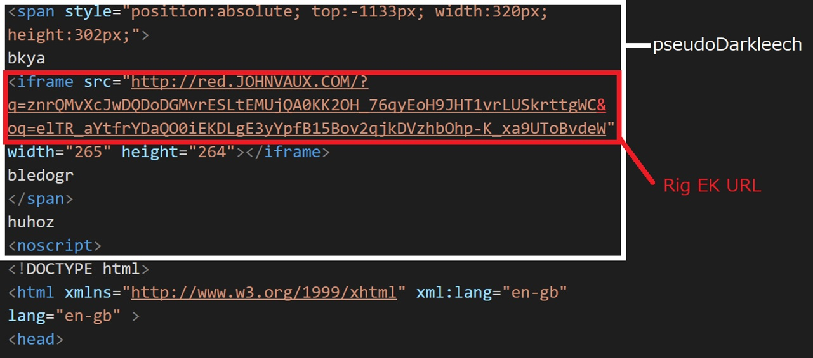

とても大規模な攻撃Campaignで, 膨大な数のWebサイトが被害に合っていましたが, 2017年4月3日頃から一切観測出来なくなりました.

特徴としては以下が挙げられます.

- injectされるコードはspanの間に, RigEKへ誘導するiframeが存在し, spanのtop値が大きなマイナス値
- maliciousなコードがinjectされる位置はhtmlタグよりも前か, bodyタグの直前のどちらか
- injectされるコードの末尾にnoscriptタグが存在するため, Compromisedサイトのコンテンツは正常に表示されない
- Compromisedサイトは古いバージョンのCMSを使っていることが多い
- 同一のIPでアクセスするとHTTP Status Code 500を返す
- 同一のIPで多くのCompromisedサイトへアクセスすると, 改ざんされていない正常なページを返す

pseudo-Darkleechのクローキングに関しては別途でドキュメントを書いているので, そちらを参照して下さい.

[pseudo-Darkleech_cloaking.md](https://github.com/koike/public/blob/master/2017/pseudo-Darkleech_cloaking.md)

### EITest
EITestに関しても, Bradが素晴らしい記事を書いています. 是非そちらを参照して下さい.

[Campaign Evolution: EITest from October through December 2016](http://researchcenter.paloaltonetworks.com/2017/01/unit42-campaign-evolution-eitest-october-december-2016/)

EITestはCompromisedサイトに対して以下のようなコードをinjectし, RigEKへ誘導します.

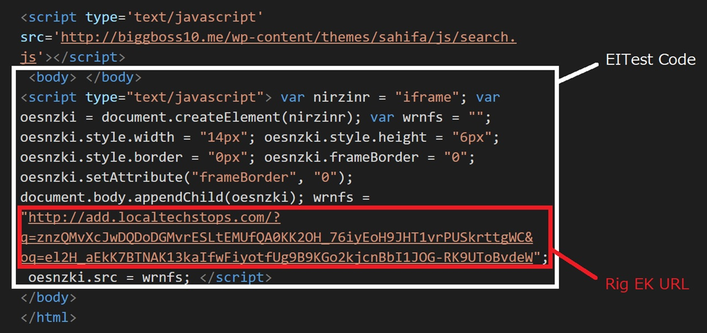

EITestはpseudo-Darkleechと同時期に活発化していたCampaignで, 日本からは観測出来ないことが殆どでしたが, pseudo-Darkleechと同じように多くのWebサイトが被害に合いました. しかし, EITestは4月28日以降観測されていません.

特徴としては以下が挙げられます.

- injectされるコードは動的にiframeを生成するJavaScriptコードで, そのiframeによってRigEKへ誘導される
- maliciousなコードはbodyタグの閉じタグ付近のinjectされる
- ユーザのGeo情報をもとに攻撃する対象を限定している
- 連続で同一IPを使ってアクセスすると正常なページを返す

### GoodMan
GoodManは2017年3月から観測されるようになったCampaignで, 5月初旬にサーバがサスペンドされました. 私をGoodManをかなり早い段階から観測していて, 初期に発生していたコードミスから, 実際にどのようなコードがinjectされるのかを知っていました. GoodManに関してはmalwarebreakdownが最も詳しく, 彼の記事を参照することをオススメします.

[Finding A ‘Good Man’](https://malwarebreakdown.com/2017/03/10/finding-a-good-man/)

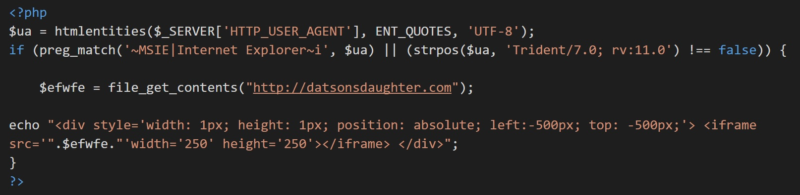

GoodManはそれほど多くのCompromisedサイトが存在していたわけではありません. そのため私はあまり多くの情報を持っていませんが, 簡単に特徴を挙げます.

- topとleftの値が-500pxのdivタグの中にiframeが存在するコードがCompromisedサイトにinjectされる
- Compromisedサイトのコードがinjectされたコードで上書きされるので, 正常にコンテンツが表示されない
- 常にRigEKへ繋がっているわけではない

### Decimal IP
Decimal IPは2017年3月末にMalwarebytesによって詳細が公開されました. 詳細はmalwarebytesの記事を参照して下さい.

[Websites compromised in ‘Decimal IP’ campaign](https://blog.malwarebytes.com/cybercrime/2017/03/websites-compromised-decimal-ip-campaign/)

これまで紹介したpseudo-DarkleechやEITestとは違い, iframeでリダイレクトせずに, HTTP Status Codeによってリダイレクトします. 動作原理自体は伝統的なDbDの手法ですが, Decimal IPを使うところが特徴です. 一般的に用いられているIPv4は10進数を4つ組み合わせて表現しますが, 他の表記方法もあります. それを利用しているのはこのCampaignで, 恐らくフィルタなどで検知されないようにすることが目的だと思われます.

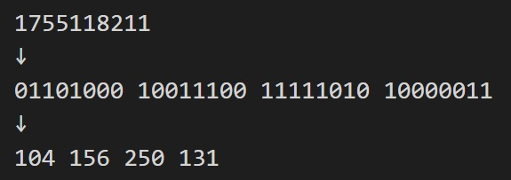

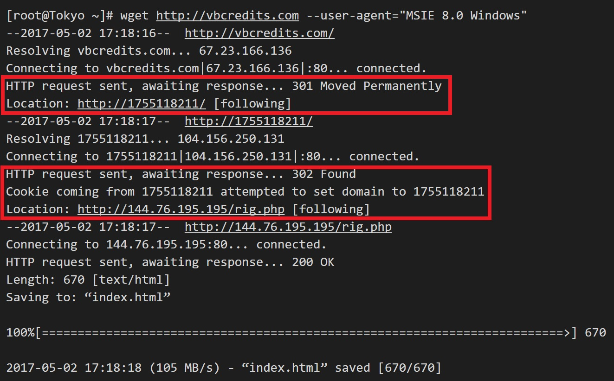

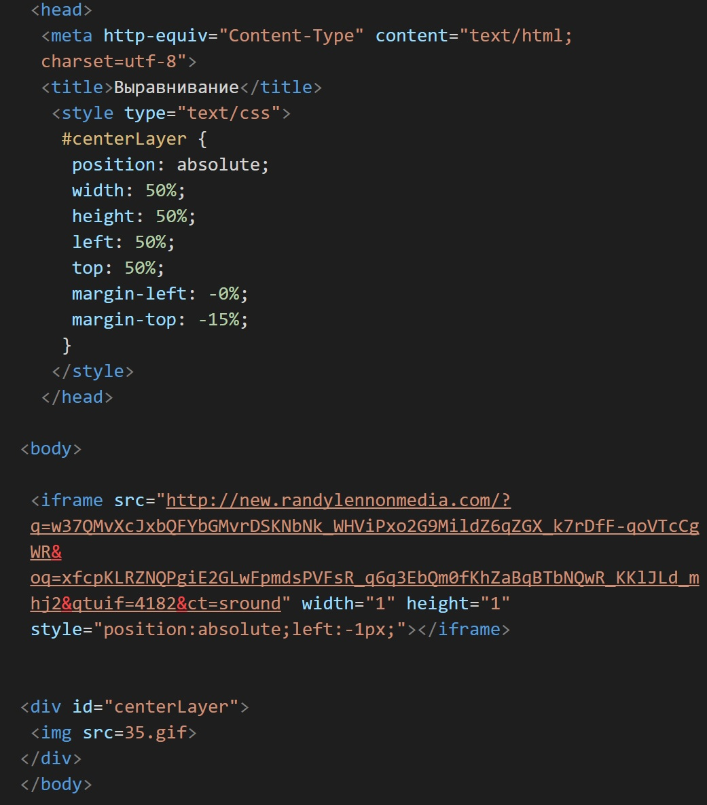

特徴としては以下が挙げられます.

- 必ずリダイレクトされるわけではない
- 複数のCompromisedサイトから同一のゲートへ到達する
- IEでアクセスした場合と, Chromeでアクセスした場合で処理が分岐する
- 同一IPで2度以上複数のCompromisedサイトへアクセスすることは出来ない

IEでアクセスした場合は上記のような動作をしますが, Chromeでアクセスした場合はRigEKへ誘導せずに, Adobe Flash Playerのアップデートを模したサイトを用いてユーザにマルウェアを実行させようとします. それらの詳細については, 別途記事を書いているので, そちらを参照して下さい.

[Overlooking Decimal IP Campaign](http://www.nao-sec.org/2017/05/overlooking-decimal-ip-campaign.html)

ロジックが原始的で, かなり荒削りな部分が目立つCampaignで, Compromisedサイトの数は多くないと思われます.

### Seamless
Seamlessは2017年2月頃から観測されていたと思いますが, 詳細な記事が出たのは3月末です. Cisco Umbrellaの記事がとても参考になるでしょう. 私はSeamlessを殆ど観測したことがないので, 詳細はその記事を参照して下さい.

[‘Seamless’ Campaign Delivers Ramnit via Rig EK](https://umbrella.cisco.com/blog/2017/03/29/seamless-campaign-delivers-ramnit-via-rig-ek/)

### Small
Smallは2017年5月初旬にZerophageによって詳細な記事が書かれました. これも私は殆ど観測したことがないので, 詳細はその記事を参照して下さい.

[Rig EK drops failed payload. (new params)](https://zerophagemalware.com/2017/05/09/rig-ek-drops-failed-payload-new-params/)

## RigEKの動き(pcapとトラフィックの図)
ここまででRigEKが様々なDbD Campaignで利用されていることが分かったでしょう. 次にCompromisedサイトからRigEKへリダイレクトしてきたユーザに対して, RigEKがどのような動きをするのか, 以下の図に説明します.

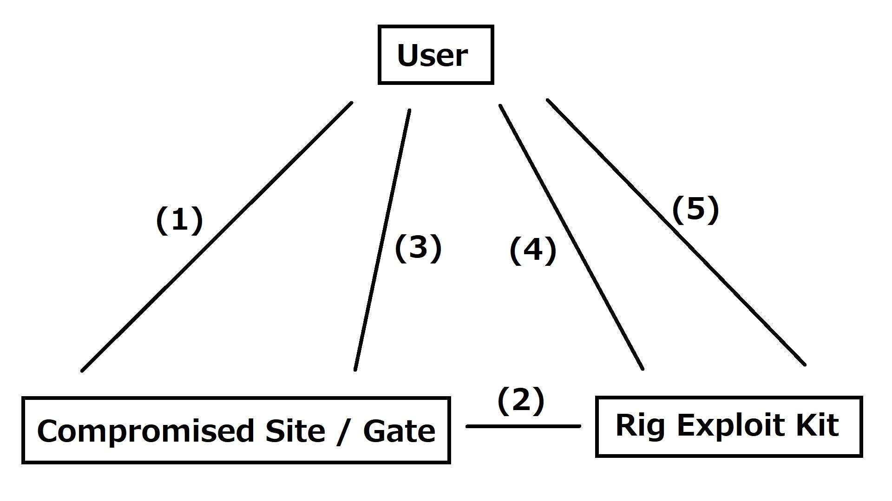

1. ユーザがCompromisedサイトへアクセスします
2. CompromisedサイトにinjectされたコードによってRigEKへ繋がるURLを生成します
3. CompromisedサイトはRigEKへ繋がるURLを含むデータをユーザへ返します
4. ユーザは受け取ったデータに従ってRIgEKへ繋がるURLにアクセスします. RigEKはアクセスしてきたユーザの環境に合わせた(ブラウザやプラグインの脆弱性を突く）ペイロードを含む難読化されたデータをユーザに返します
5. ユーザはペイロードによってマルウェアをダウンロードし, 実行します

こうした流れによってユーザはWebサイトにアクセスしただけでマルウェアに感染します.

具体的なDecimal IPにおけるトラフィックを以下に示します. 実際のpcapファイルは[こちら](decimalip_rig.pcap)にあるので, 詳細を見たい人は参照して下さい.

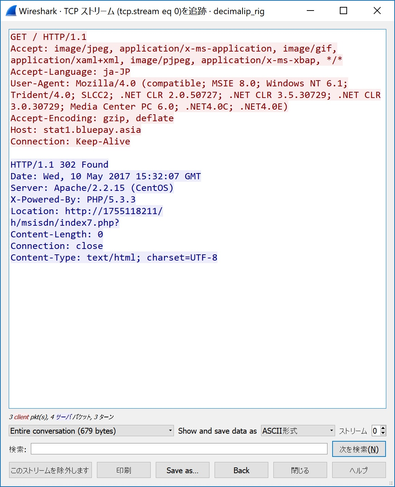

まずユーザはCompromisedサイトへアクセスします. するとCompromisedサイトからはHTTP Status Code 302によってLocationへリダイレクトを行います.


リダイレクト先でも同じようにHTTP Status Code 302によってrig.phpというファイルへリダイレクトします.

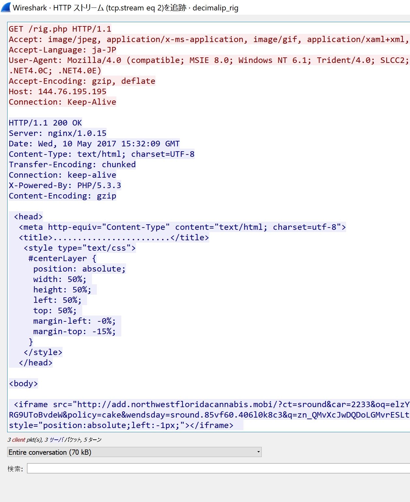

rig.phpではRigEKへ誘導するURLに接続します.


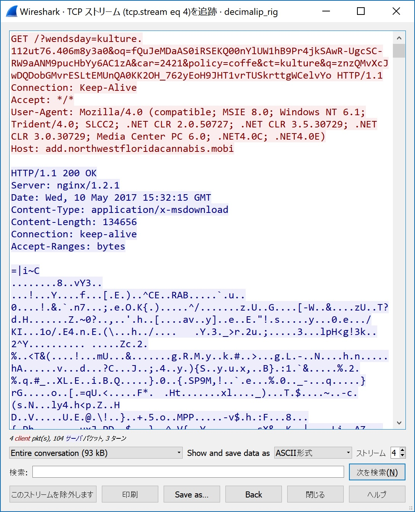

すると難読化されたJavaScriptを含むhtmlをブラウザが読み込み, 何らかの脆弱性を突くコードが走ることによってマルウェアがダウンロードされ, 実行されます.

## RigEKのファイル解析(難読化html)
上記の説明で, RigEKのおおよその動きは理解出来たかと思います. RigEKへリダイレクトされるところまでは全く特に難しい部分もないですが, RigEKから送られてくる難読化されたコードが何をしているのか, 具体的に示します.

以下では私が以前書いた[Analyzing Rig Exploit Kit vol.1](http://www.nao-sec.org/2017/04/analyzing-rig-exploit-kit-vol1.html)のコードを参照します. 現在のRigEKのコードと違う部分も多少あるかもしれませんが, その部分は適宜読み替えて下さい.

CompromisedサイトなどのiframeからRigEKへ誘導されると, まず以下のようなhtmlが返ってきます.

<script src="https://gist.github.com/anonymous/1911aeeb85b10cc76e8fcdf61633a6b5.js"></script>

このhtmlは3つのJavaScriptセクションに分割することができ, それぞれ3行のJavaScriptコードで, 同一の復号ルーチンで難読化を解除することが出来ます. もっともコード量の少ない3つ目のセクションを例に, 難読化を解除してみます.

<script src="https://gist.github.com/anonymous/ded41ab808e19110d449046fe8af0850.js"></script>

このコードを読みやすく整形すると以下のようになります.

<script src="https://gist.github.com/anonymous/d4603c14265cc0ad524d7ead73988e9a.js"></script>

単純に2つに分割されたJavaScriptコードをつなぎ合わせ, evalで実行しているだけです. 実行されているコードは以下のようになります.

<script src="https://gist.github.com/anonymous/d92f3be6bc24c4e8d6ceecfab066a393.js"></script>

Base64エンコードされた文字列を復号し実行しています. 実行されているコードは各セクションで以下のようになっています.

<script src="https://gist.github.com/anonymous/d22637e721326772ead570975c836ae5.js"></script>

<script src="https://gist.github.com/anonymous/d00d27f786ea41aa36ed02069dcb5abb.js"></script>

<script src="https://gist.github.com/anonymous/a00755dfe223da251f2aea4f92d69969.js"></script>

VBScriptのコードが2つと, swfを読み込むコードが1つです. これらのコードはブラウザなどの脆弱性を突くコードで, これらによってマルウェアがダウンロードされ, 実行されます.

## User-Agentとペイロードの関係
先ほど```RigEKはアクセスしてきたユーザの環境に合わせた(ブラウザやプラグインの脆弱性を突く）ペイロードを含む難読化されたデータをユーザに返します```と書きましたが, 実際の対応関係について紹介します.

以下は私が2017年5月11日に, IE6~11を使ってRigEKへアクセスした際に取得したペイロードを元に作成した対応表です.

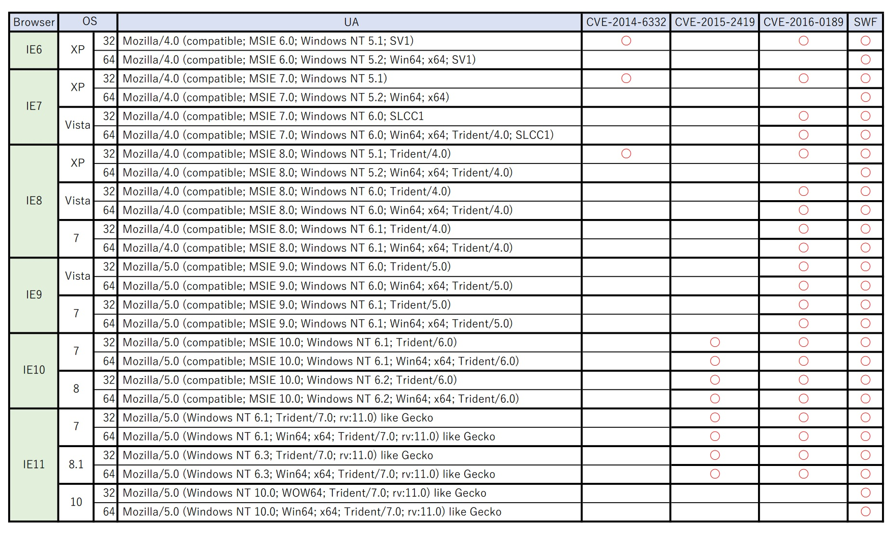

PDFバージョンは[こちら](rig_ua.pdf)にあります.

(私はswfについて全く知識がないので, swfで利用されている脆弱性については調査していませんが, swfが読み込まれるコードが存在するかどうかをマークしています)

RigEKはユーザから送られてくるリクエスト内のUser-Agentを利用して, ユーザの環境でpwn出来るようなペイロードを選んで送っていることが分かります.

## ペイロードの紹介
//

## さいごに
以上が```私が見たRig Exploit Kitの姿```です. Drive-by Download攻撃及びExploit Kitは非常に高度に進化し, 今後も多くの被害をもたらすのではないかと危惧されています. この記事を読むことで「それらが実際にどのように行われているのか」知ることが出来れば幸いです.

## 参考文献
- [Campaign Evolution: pseudo-Darkleech in 2016](http://researchcenter.paloaltonetworks.com/2016/12/unit42-campaign-evolution-pseudo-darkleech-2016/)
- [pseudo-Darkleech_cloaking.md](https://github.com/koike/public/blob/master/2017/pseudo-Darkleech_cloaking.md)
- [Campaign Evolution: EITest from October through December 2016](http://researchcenter.paloaltonetworks.com/2017/01/unit42-campaign-evolution-eitest-october-december-2016/)
- [Finding A ‘Good Man’](https://malwarebreakdown.com/2017/03/10/finding-a-good-man/)
- [Websites compromised in ‘Decimal IP’ campaign](https://blog.malwarebytes.com/cybercrime/2017/03/websites-compromised-decimal-ip-campaign/)
- [Overlooking Decimal IP Campaign](http://www.nao-sec.org/2017/05/overlooking-decimal-ip-campaign.html)
- [‘Seamless’ Campaign Delivers Ramnit via Rig EK](https://umbrella.cisco.com/blog/2017/03/29/seamless-campaign-delivers-ramnit-via-rig-ek/)
- [Rig EK drops failed payload. (new params)](https://zerophagemalware.com/2017/05/09/rig-ek-drops-failed-payload-new-params/)
- [Analyzing Rig Exploit Kit vol.1](http://www.nao-sec.org/2017/04/analyzing-rig-exploit-kit-vol1.html)
